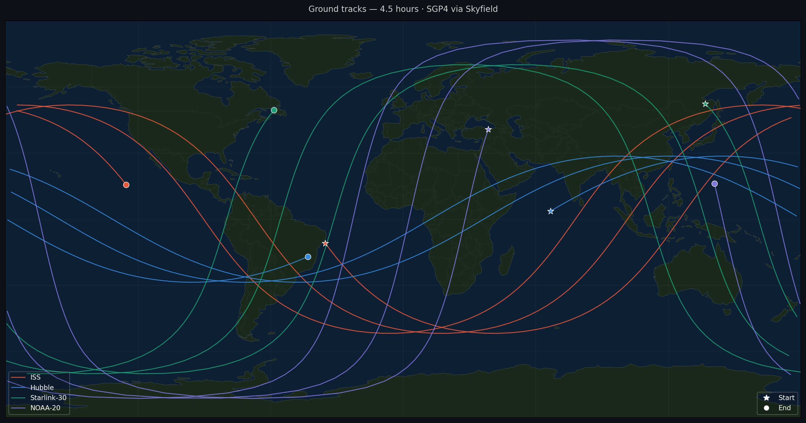

## Qué hace

Toma los elementos orbitales reales de cuatro satélites —la Estación Espacial Internacional,
el Hubble, un Starlink y el NOAA-20— directamente de CelesTrak, y propaga sus trayectorias por
dos caminos distintos.

**SGP4**, el propagador analítico que se usa operativamente para todo objeto rastreado
públicamente. Es el estándar y sirve de referencia.

**Un integrador Runge–Kutta de cuarto orden escrito desde las ecuaciones de movimiento**, con
tres modelos de fuerza que se pueden encadenar:

- gravedad kepleriana, tratando a la Tierra como masa puntual;
- perturbación J2, que incorpora el achatamiento ecuatorial de la Tierra;
- J2 más arrastre atmosférico, con un modelo exponencial por capas.

## El detalle que suele salir mal

SGP4 no devuelve posiciones en un sistema inercial estándar: las devuelve en TEME, su propio
sistema de referencia. Convertir eso a latitud y longitud **no es una rotación por el tiempo
sidéreo**, como suele hacerse. TEME difiere de los sistemas inerciales estándar por precesión
y nutación, y saltearse esas correcciones introduce un error sistemático en las trazas.

El proyecto aplica la cadena completa de transformación TEME → GCRS → ITRF, con las
correcciones de la IAU.

## Lo que este proyecto no hace

Una comparación cuantitativa seria entre el integrador propio y SGP4 **no se puede hacer
midiendo el error de posición en coordenadas cartesianas**: ese error mezcla dos cosas
distintas, la diferencia real entre los modelos de fuerza y la diferencia de fase orbital, que
crece sin que el modelo sea peor. Hacerlo bien exige trabajar en elementos orbitales
osculantes. Queda para un proyecto siguiente y está anotado como tal.

El modelo de atmósfera exponencial también tiene su límite: es un modelo medio estático,
mientras que la densidad real en órbita baja varía fuertemente con la actividad solar y
geomagnética. Da órdenes de magnitud del arrastre, no propagación de precisión.

## Código

[github.com/julietaamendola/orbit-propagator](https://github.com/julietaamendola/orbit-propagator)

Python, con `sgp4`, `skyfield`, `numpy`, `scipy`, `matplotlib` y `cartopy`. Referencias:
Vallado & McClain, *Fundamentals of Astrodynamics and Applications*, y la documentación de
formatos de CelesTrak.
